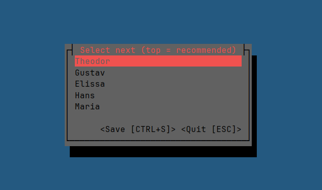

[](https://github.com/eum2o/ftree/actions)
[](https://crates.io/crates/e2o-ftree)
[](https://github.com/eum2o/ftree/releases)


# Fair Next

A simple command line tool that displays a list. When a list item is selected, it's moved to the bottom. The list is
persisted in a `names.txt` file next to the executable.

Motivation: I attend online meetings (e.g. daily standup) where I have to select the next speaker. I use this tool for a
fair selection of the next speaker.



## Installation

You can either download the executable manually or use Cargo to install this tool.

### Cargo

You can install `fn` using [Cargo](https://doc.rust-lang.org/cargo/):

```
cargo install fair_next
```

For more information about the crate, visit [https://crates.io/crates/fair_next](https://crates.io/crates/e2o-ftree).

### Pre-built Executables

Alternatively, you can download pre-built executables for various platforms from the GitHub releases page:

[https://github.com/eum2o/fair_next/releases](https://github.com/eum2o/fair_next/releases)

## How to Use

- Run the downloaded/installed executable (`fn` in your terminal, if installed with Cargo).
- If you run it the first time, you'll see a message that you need to add names (or arbitrary list items) to
  the `names.txt` file next to the executable. The path is displayed in the UI.
- Select a user with the arrow keys and hit `Enter` to confirm. The user will be moved to the bottom.
- Save to save without quitting.
- Quit to quit without saving.

